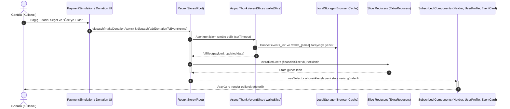

# İyilik Ağı Proje Dokümantasyonu

## Proje Adı ve Açıklaması
**İyilik Ağı**, STK'ların sosyal sorumluluk ve bağış kampanyalarını yönettiği, cüzdan ve bağış ödeme simülasyonları içeren şeffaf ve denetlenebilir bir yardımlaşma platformudur. Gönüllülerin katılım başvurusu yapabilmesini, bağışçıların güvenli simülasyonla bakiye yükleyip projeleri fonlamasını ve yöneticilerin tüm operasyonları izleyip düzenlemesini sağlar.

---

## Teknoloji Yığını (Tech Stack)
- **Çekirdek:** React (v19.2.7), React DOM (v19.2.7)
- **Yönlendirme:** React Router Dom (v7.18.0)
- **State Yönetimi:** Redux Toolkit (v2.12.0), React Redux (v9.3.0)
- **Grafik/Analiz:** Recharts (v3.9.0)
- **Stil/Tasarım:** Tailwind CSS (v4.3.1), @tailwindcss/vite (v4.3.1)
- **Derleme/Analiz:** Vite (v8.1.0), Oxlint (v1.69.0)

---

## Klasör Yapısı
```text
iyilik-agi/
├── public/                    # db.json (seed verileri), resimler ve site ikonları
└── src/                       # Kaynak kodlar
    ├── components/            # Tekrar kullanılabilir React bileşenleri
    │   ├── Admin/             # Admin sol menüsü, metrik kartları ve formlar
    │   ├── Common/            # Navbar ve Footer yerleşimleri
    │   ├── Event/             # Kampanya kartı, kalan süre sayacı ve ilerleme çubuğu
    │   ├── Wallet/            # Sanal kredi kartı ve bakiye tablosu
    │   ├── AdminLayout.jsx    # Admin sayfaları ortak yerleşimi
    │   └── GlassCard.jsx      # Glassmorphism (cam) tasarımlı kart yapısı
    ├── pages/                 # Sayfa düzeyindeki React bileşenleri
    │   ├── Admin/             # Yönetim, raporlar, düzenleme ve gönüllü takibi sayfaları
    │   ├── Home.jsx, About.jsx, Contact.jsx, Login.jsx, Events.jsx vb.
    ├── store/                 # Redux Toolkit global store ve slice klasörü
    ├── utils/                 # urgency.js (süreye göre renk/badge belirleyici)
    └── App.jsx, index.css     # Yönlendirme ve Tailwind v4 ana yapılandırması
```

---

## Kurulum ve Çalıştırma
```bash
npm install     # Bağımlılıkları yükler
npm run dev     # Yerel test sunucusunu başlatır (http://localhost:5173)
npm run build   # Üretim çıktısını derler
npm run lint    # Oxlint statik analizi çalıştırır
```

---

## Route Tablosu

| Rota (Path) | Sayfa Bileşeni | Yönetici Koruması | Açıklama |
| :--- | :--- | :---: | :--- |
| `/` | `Home` | Hayır | Öne çıkan kampanya, süreçler, başarı hikayeleri ve SSS. |
| `/events` | `Events` | Hayır | Kategori filtreli ve arama özellikli kampanya listesi. |
| `/events/:id` | `EventDetail` | Hayır | Detay açıklaması, bütçe ilerleme barı ve canlı bağış akışı. |
| `/about` | `About` | Hayır | Platformun kuruluş amacı, vizyonu ve temel başarı istatistikleri. |
| `/contact` | `Contact` | Hayır | Mesaj göndermeyi sağlayan cam tasarımlı iletişim formu. |
| `/login` | `Login` | Hayır | Oturum açma, kayıt olma ve test hızlı doldurma butonları. |
| `/payment` | `PaymentSimulation` | Hayır | Kartla para yükleme, doğrudan bağış veya bakiye ile bağış. |
| `/profile` | `UserProfile` | Hayır (Gönüllü) | Bakiye durumu, katıldığı etkinlikler ve Excel/PDF rapor kaydetme. |
| `/admin` | `AdminDashboard` | Hayır (Açık Rota) | Yönetici paneli; aylık bağış grafiği ve genel platform metrikleri. |
| `/admin/events` | `EventsManagement` | Hayır (Açık Rota) | Tüm kampanyaların listelendiği, silme ve düzenleme tablosu. |
| `/admin/new-event` | `NewEvent` | Hayır (Açık Rota) | Yeni sosyal sorumluluk kampanyası başlatma formu. |
| `/admin/edit-event/:id`| `EditEvent` | Hayır (Açık Rota) | Kampanya detaylarını güncelleme formu. |
| `/admin/reports` | `FinancialReports` | Hayır (Açık Rota) | Finansal durum özet tablosu ve manuel offline bağış ekleme formu. |
| `/admin/volunteers` | `Volunteers` | Hayır (Açık Rota) | Gönüllülerin görev/saat bazlı izlendiği takip tablosu. |

---

## Sayfalar (Pages)
- **Home:** Karşılama, öne çıkan etkinlik detayları, çalışma süreci, tamamlanan başarı hikayeleri ve SSS.
- **Events:** Kategori sekmeleri veya metin araması ile filtrelenebilen aktif kampanya listesi.
- **EventDetail:** Bağış yapma, gönüllü başvurusu, sosyal medya paylaşım linkleri ve canlı bağış dökümü.
- **About:** Kuruluş hikayesi, şeffaflık vizyonu, değerler ve temel başarı istatistikleri.
- **Contact:** Teknik destek veya işbirliği taleplerini ileten iletişim formu.
- **Login:** Oturum açma, kayıt olma ve hızlı test doldurma butonları.
- **PaymentSimulation:** Sanal kartla para yükleme (3D Secure SMS kodu ile) veya cüzdanla bağış yapma adımları.
- **UserProfile:** Cüzdan bakiyesi kartı, geçmiş bağış tablosu ve gönüllü olarak katıldığı görevler.
- **Admin Pages:** Yönetici grafikleri, kampanya oluşturma/silme/güncelleme, finansal onaylar ve gönüllü saat takibi.

---

## Bileşenler (Components)
- **Navbar & Footer:** Sayfa menüleri, cüzdan bakiye gösterimi, logolar ve iletişim kanallarını sunan şablonlar.
- **EventCard:** Kampanya görselini, ilerleme barını, kalan günü ve bağışçı sayılarını özetleyen kart.
- **CountdownTimer:** Kalan süreyi gün bazında dinamik renklerle gösteren sayaç aracı.
- **ProgressBar:** Projenin fonlanma oranına göre renk alan ilerleme çubuğu.
- **DonationModal:** Hızlı bağış seçenekleriyle bağışı tamamlamayı kolaylaştıran modal penceresi.
- **CreditCardVisual:** 3D dönme (flip) efektli sanal kredi kartı görseli.
- **WalletCard:** Kullanıcı profilinde bakiye gösteren ve yükleme sayfasına yönlendiren cüzdan kartı.
- **TransactionTable:** Kullanıcının tüm cüzdan ve bağış hareket geçmişini listeleyen tablo.
- **AdminSidebar:** Yönetici sayfaları arası geçiş ve çıkış kontrollerini barındıran dikey menü.
- **DashboardCards:** Toplam bağış, ortalama tamamlanma ve aktif etkinlik sayılarını gösteren metrikler.
- **EventForm:** Zorunlu alanları denetleyen ve varsayılan görselleri atayan kampanya formu.
- **ReportTable:** Proje bütçelerini listeleyen tablo ve manuel bağış ekleme aracı.
- **AdminLayout & GlassCard:** Sayfa yerleşimi sağlayan şablonlar ve glassmorphism buzlu cam kart stili.

---

## State Yönetimi

### 1. authSlice
- **State:** `user` (name, email, role), `isAuthenticated`, `activeTab`.
- **Actions:** `login`, `logout`, `setActiveTab`.

### 2. eventSlice
- **State:** `list`, `selectedEvent`, `categories`, `selectedCategory`, `status`, `actionStatus`, `error`.
- **Actions/Thunks:** `setSelectedCategory`, `selectEventForEdit`, `clearSelectedEvent`, `fetchEvents`, `addEventAsync`, `editEventAsync`, `deleteEventAsync`, `addDonationToEventAsync`.

### 3. walletSlice
- **State:** `balance`, `transactions`, `participatedEvents`, `status`, `error`, `actionStatus`.
- **Actions/Thunks:** `clearWalletError`, `fetchWalletData`, `depositMoneyAsync`, `makeDonationAsync`, `joinEventAsync`.

### 4. financialSlice
- **State:** `records`.
- **Actions/Thunks:** `setRecordsState`, `fetchRecords`, `addRecordAsync`, `editRecordAsync`, `deleteRecordAsync`.

### Cross-Slice Entegrasyonu
- `financialSlice`, `eventSlice` thunk'larını (`fetchEvents`, `addEventAsync`, `editEventAsync`, `deleteEventAsync`, `addDonationToEventAsync`) dinler.
- Her eylemde finansal tablolar (bütçeler, toplanan fonlar ve onay durumları) eş zamanlı olarak otomatik güncellenir.
- Fon hedefine ulaşan projelerin durumu kendiliğinden "Onaylandı" olarak güncellenir.

---

## Veri Akışı Diyagramı


---

## İş Mantığı (Domain Logic)

- **Aciliyet Durumu (`urgency.js`):** Kalan gün < 10 ise kırmızı ("Süre Azalıyor!"), <= 20 ise turuncu ("Son Günler"), > 20 ise yeşil tema rozeti döner.
- **Bağış İlerleme Yüzdesi:** 
  $$\text{Yüzde} = \min\left(\text{round}\left(\frac{\text{Toplanan Tutar}}{\text{Hedef Tutar}} \times 100\right), 100\right)$$
- **Ortalama Tamamlanma Yüzdesi:**
  $$\text{Ortalama} = \frac{\sum(\text{Projelerin İlerleme Yüzdeleri})}{\text{Toplam Proje Sayısı}}$$
- **Geri Sayım Zamanlayıcısı:** `setInterval` ile her saniye zaman birimleri (saniye -> dakika -> saat -> gün) azaltılır; hepsi 0 olduğunda durdurulur.

---

## Veri Yapısı

### Event Model
```json
{
  "id": "string",
  "title": "string",
  "category": "string",
  "targetAmount": 1000000,
  "raisedAmount": 345000,
  "daysLeft": 99,
  "donorCount": 128,
  "donations": [{ "id": "string", "donorName": "string", "amount": 500, "timeAgo": "string" }]
}
```

### User Model
```json
{
  "name": "string",
  "email": "string",
  "password": "string",
  "role": "gönüllü"
}
```

### Wallet & Transactions Model
```json
{
  "balance": 15000,
  "transactions": [{ "id": "string", "campaignTitle": "string", "category": "string", "amount": 500, "date": "string" }]
}
```

### Volunteer Model
```json
{
  "name": "string",
  "email": "string",
  "task": "string",
  "hours": 42,
  "status": "AKTİF"
}
```

### Financial Record Model
```json
{
  "id": "string",
  "project": "string",
  "sponsor": 0,
  "raised": 7450000,
  "spent": 5900000,
  "status": "Onaylandı"
}
```

---

## Stil ve Tasarım
- **Renkler:** Pine Teal (`#0B6E5F`), Ember Coral (`#D9533B`), Muted Gold (`#B7892F`), Institutional Navy (`#16314D`), Genel Arka Plan Slate 50 (`#F8FAFC`).
- **Yazı Tipi:** Plus Jakarta Sans ve Inter; monospace (kod/tutar alanlarında).
- **Tasarım:** Responsive yapı, `.liquid-glass` sınıfları ile glassmorphism cam kart tasarımı, hover ve başarı animasyonları gibi mikro etkileşimler.

---
